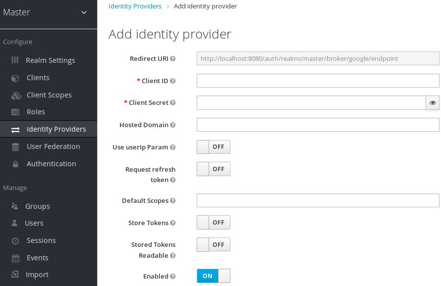
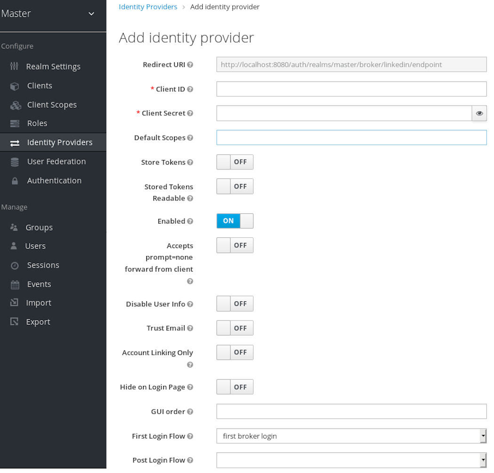

% Self-Hosted Single Sign-On
% https://github.com/STL2600/sso-talk


# Single Sign-On

- One user ID and password
- To many independent and un-related systems

## Benefits

- Mitigate risks when acessing 3rd-party sites
- Less passwords to remember
- Save time entering credentials

## Risks

- Keys to the kingdom without 2FA.
- If the SSO breaks, all your apps break.

# LDAP

- Lightweight Directory Access Protocol

## LDAP

"Open, vendor-neutral, industry standard application protocol for accessing and maintaining distributed directory information services over an Internet Protocol (IP) network."

Basically just a specialized query language and database.

## Open-source LDAP Directories

- OpenLDAP
- 389 Directory Server
- Samba

## OpenLDAP

- Defacto recommendation
- Everything done through LDAP queries
- Pain in the ass to manage
- Never really got it working well, particularly with TLS


## 389 Directory Server

- Red Hat's alternative to Active Directory
- Software stack to replicate the functionality of a complete MS AD

## Samba

- Not just for file shares anymore!
- Since Samba 4.0 (released in 2012), it's been able to run as an AD-DC

# Setting up Samba

- Setup a VM or Raspberry Pi
- As per usual, this will be an Arch Linux build.

## Required Packages

You'll need more than just Samba
- bind (optional)
- krb5
- ntp
- python-dnspython
- openresolv
- samba
- openldap (just for the tools)

## Provision your DC

`samba-tool domain provision --use-rfc2307 --interactive`

This sets up the LDAP, Kerberos, and DNS servers.

Also other basic configurations needed for a basic directory have been automated so you don't fuck it up.

### Provisioning your DC

The interactive provisioning will prompt you for:
- Realm or TLD
- Internal AD style domain name
- Server role (i.e. Domain controller)
- DNS Backend (BIND or Samba)
- DNS Forwarder IP if using Samba DNS ( we use none)
- Admin password

### Provisioning your DC

Or you can specify it all manually:

```
sudo samba-tool domain provision --use-rfc2307 \
--realm SECRETLAIR.ORG \
--domain secretlair \
--server-role dc \
--dns-backend SAMBA_INTERNAL \
--adminpass adminpassword
```

## Configure NTP

As with many things, timing is critical

The Arch Linux wiki provides a suitable example you can copy for your `/etc/ntp.conf` file.

### Configure NTP

Directory permissions for Samba:
- `install -d /var/lib/samba/ntp_signd`
- `chown root:ntp /var/lib/samba/ntp_signd`
- `chmod 0750 /var/lib/samba/ntp_signd`

### Start NTP Daemon
- `systemctl enable ntpd.service`
- `systemctl start ntpd.service`

## BIND

It's only required if youneed to maintain DNS zones for external domains.

If you do, set it up now.

## Kerberos

The provisioning process should've created a `krb5.conf` file.

Install it:
- `mv /etc/krb5.conf{,.default}`
- `cp /var/lib/samba/private/krb5.conf /etc`

## Setup local DNS

Create `/etc/resolv.conf.tail`:
```
# Samba configuration
search internal.domain.tld
# If using IPv6, uncomment the following line
#nameserver ::1
nameserver 127.0.0.1
```

### Setup local DNS

Set permissions and regenerate `resolve.conf`:
- `chmod 644 /etc/resolv.conf.tail`
- `resolvconf -u`

## Enable TLS for Samba

Edit `/etc/samba/smb.conf`
```
tls enabled  = yes
tls keyfile  = /etc/ssl/private/Lets_Encrypt-key.pem
tls certfile = /etc/ssl/private/Lets_Encrypt-cert.pem
tls cafile   = /etc/ssl/private/Lets_Encrypt-ca.pem
```

## Start Samba!

`systemctl enable samba.service`
`systemctl start samba.service`

## Test DNS

`host -t SRV _ldap._tcp.internal.domain.com.`
`host -t SRV _kerberos._udp.internal.domain.com.`
`host -t A server.internal.domain.com.`

### Test DNS

`_ldap._tcp.internal.domain.com has SRV record 0 100 389 server.internal.domain.com.`
`_kerberos._udp.internal.domain.com has SRV record 0 100 88 server.internal.domain.com.`
`server.internal.domain.com has address xxx.xxx.xxx.xxx`

## Test NT Auth

`smbclient //localhost/netlogon -U Administrator -c 'ls'`

### Test NT Auth

```
Domain=[INTERNAL] OS=[Unix] Server=[Samba 4.1.2]
  .                                   D        0  Wed Nov 27 23:59:07 2013
  ..                                  D        0  Wed Nov 27 23:59:12 2013

		50332 blocks of size 2097152. 47185 blocks available
```

## Test Kerberos

`kinit administrator@INTERNAL.DOMAIN.COM`

### Test Kerberos

Actually, we don't care right now.

## Test LDAP

- `samba-tool forest directory_service dsheuristics 0000002 -H ldaps://localhost --simple-bind-dn='administrator@secretlair.org'`
- `ldapsearch -b DC=secretlair,DC=org -H ldaps://localhost -x`

## Further LDAP tweaking

Rather than opening up the whole directory to be read, only make relevent parts readable:

The root domain:
`samba-tool dsacl set --objectdn=DC=secretlair,DC=org --sddl='(A;;RPLCLORC;;;AN)' --simple-bind-dn="administrator@secretlair.org" --password=Passw0rd`

Users:
`samba-tool dsacl set --objectdn=CN=Users,DC=secretlair,DC=org --sddl='(A;CI;RPLCLORC;;;AN)' --simple-bind-dn="administrator@secretlair.org" --password=Passw0rd`

Groups:
`samba-tool dsacl set --objectdn=CN=Builtin,DC=secretlair,DC=org --sddl='(A;CI;RPLCLORC;;;AN)' --simple-bind-dn="administrator@secretlair.org" --password=Passw0rd`


### Add UNIX attributes

If you are going to use the directory for Unix-style logins:

`samba-tool schema attribute modify uid --searchflags=9`
`samba-tool schema attribute modify nsUniqueId --searchflags=9`
`samba-tool schema attribute modify uidnumber --searchflags=9`
`samba-tool schema attribute modify gidnumber --searchflags=9`
`samba-tool schema attribute modify x509-cert --searchflags=8`
`samba-tool schema attribute modify sshPublicKey --searchflags=8`
`samba-tool schema attribute modify gecos --searchflags=8`
`samba-tool schema attribute modify loginShell --searchflags=8`
`samba-tool schema attribute modify home-directory --searchflags=24`

### Harden your AD

Prevent any user from being able to domian join machiens:

`samba-tool domain settings account_machine_join_quota 0 -H ldaps://localhost --simple-bind-dn='administrator@secretlair.org'`

### Harden your AD

Disable Guest account:

`samba-tool user disable Guest -H ldaps://localhost --simple-bind-dn='administrator@secretlair.org'`

### Harden your AD

Since Samba is pretending to be a MS DC, most other best practices should work.

## Add Users

`smbpasswd -a username`

### Comparision to OpenLDAP:

```
dn: uid=johndoe,ou=People,dc=example,dc=org
objectClass: top
objectClass: person
objectClass: organizationalPerson
objectClass: inetOrgPerson
objectClass: posixAccount
objectClass: shadowAccount
uid: johndoe
cn: John Doe
sn: Doe
givenName: John
title: Guinea Pig
telephoneNumber: +0 000 000 0000
mobile: +0 000 000 0000
postalAddress: AddressLine1$AddressLine2$AddressLine3
userPassword: {CRYPT}xxxxxxxxxx
labeledURI: https://archlinux.org/
loginShell: /bin/bash
uidNumber: 9999
gidNumber: 9999
homeDirectory: /home/johndoe/
description: This is an example user

ldapadd -D "cn=Manager,dc=example,dc=org" -W -f user_joe.ldif
```

And hope you didn't make a typo.

### Other user commands

- List users: `samba-tool user list`
- Change password: `smbpasswd username`
- Delete user: `smbpasswd -x username`


## Add Groups

Create a group:
`samba-tool group add groupname --gid-number=10001 --nis-domain=internal`

Add members to group:
`samba-tool group addmembers group-name joe,jane,frank,alice`

List members of group:
`samba-tool group listmembers group-name`

# Keycloak

# What is it?

 - Web app swiss army knife
 - Single sign on client
 - Single sign on provider
 - Identity server

# Connections

 - OpenID Connect
 - OAuth
 - SAML
 - Social Logins
 - LDAP
 - Active Directory

# Setup

## Docker

```
docker run \
    -p 8080:8080 \
    quay.io/keycloak/keycloak:13.0.1
```

## Docker Compose

```
keycloak-db:
  container_name: keycloak-db
  image: mariadb
  restart: always
  volumes:
    - /keycloak/db:/var/lib/mysql
  environment:
    - MYSQL_ROOT_PASSWORD=password
    - MYSQL_DATABASE=keycloak
    - MYSQL_USER=keycloak
    - MYSQL_PASSWORD=password

keycloak:
  container_name: keycloak
  image: jboss/keycloak:9.0.3
  restart: always
  environment:
    - DB_VENDOR=mysql
    - DB_DATABASE=keycloak
    - DB_USER=keycloak
    - DB_PASSWORD=password
    - DB_ADDR=keycloak-db
    - DB_PORT=3306
    - KEYCLOAK_FRONTEND_URL=https://server.com/auth
    - PROXY_ADDRESS_FORWARDING=true
  depends_on:
    - keycloak-db
  ports:
    - 8080:8080
```

## Create Admin User

 - Go To: `https://server.com/auth`
 - Follow the prompts

## Create A Realm

 - Go To: `https://server.com/`
 - Log in with admin user
 - Click "Master"
 - Click Add
 - Set Name

# User Management

## Standalone

 - Create users in the admin console
 
## Standalone


## Social

 - https://www.keycloak.org/docs/latest/server_admin/index.html#social-identity-providers

## Social



## Social


## Social


## Social


## Social



## LDAP

 - https://www.keycloak.org/docs/latest/server_admin/index.html#_ldap

## LDAP

 - 

# Usage

## OpenID Connect

 - The easiest way to integrate by far
 - Most apps: /realms/{realm-name}/.well-known/openid-configuration
 - Nextcloud

## SAML

 - Just Don't

## LDAP / Active Directory

 - See Joe's Talk `;)`
 - Can't use with social logins

## Identity Proxy

 - https://github.com/oauth2-proxy/oauth2-proxy
 - Secure any webapp behind authentication
 - Can double up to secure against pre-auth exploits (*cough* HomeAssistant *cough*)
 - Probably not supported by apps
  
## Identity Proxy

```
oauth-proxy:
  container_name: oauth-proxy
  image: quay.io/oauth2-proxy/oauth2-proxy 
  restart: always
  environment:
   - OAUTH2_PROXY_UPSTREAMS=http://127.0.0.1:8080/
   - OAUTH2_PROXY_PROVIDER=keycloak
   - OAUTH2_PROXY_CLIENT_ID=<client you have created>
   - OAUTH2_PROXY_CLIENT_SECRET=<your client's secret>
   - OAUTH2_PROXY_LOGIN_URL="http(s)://<keycloak host>/auth/realms/<your realm>/protocol/openid-connect/auth"
   - OAUTH2_PROXY_REDEEM_URL="http(s)://<keycloak host>/auth/realms/<your realm>/protocol/openid-connect/token"
   - OAUTH2_PROXY_PROFILE_URL="http(s)://<keycloak host>/auth/realms/<your realm>/protocol/openid-connect/userinfo"
   - OAUTH2_PROXY_VALIDATE_URL="http(s)://<keycloak host>/auth/realms/<your realm>/protocol/openid-connect/userinfo"
   - OAUTH2_PROXY_KEYCLOAK_GROUP=<first_allowed_user_group>
   - OAUTH2_PROXY_EMAIL_DOMAINS=*
   - OAUTH2_PROXY_COOKIE_SECRET=Y0KYcBBqJ6Cj886voJciHA==
   - OAUTH2_PROXY_HTTP_ADDRESS=0.0.0.0:4180
  depends_on:
    - keycloak
  ports:
    - 4180:4180
```

# Where can you login now?

## Stuff We've Discussed

- Matrix Chat
- OpenVPN
- Gitea
- Nextcloud

## With some work:

- Your computer
- Your home Wi-Fi

# Examples?

# Questions?

