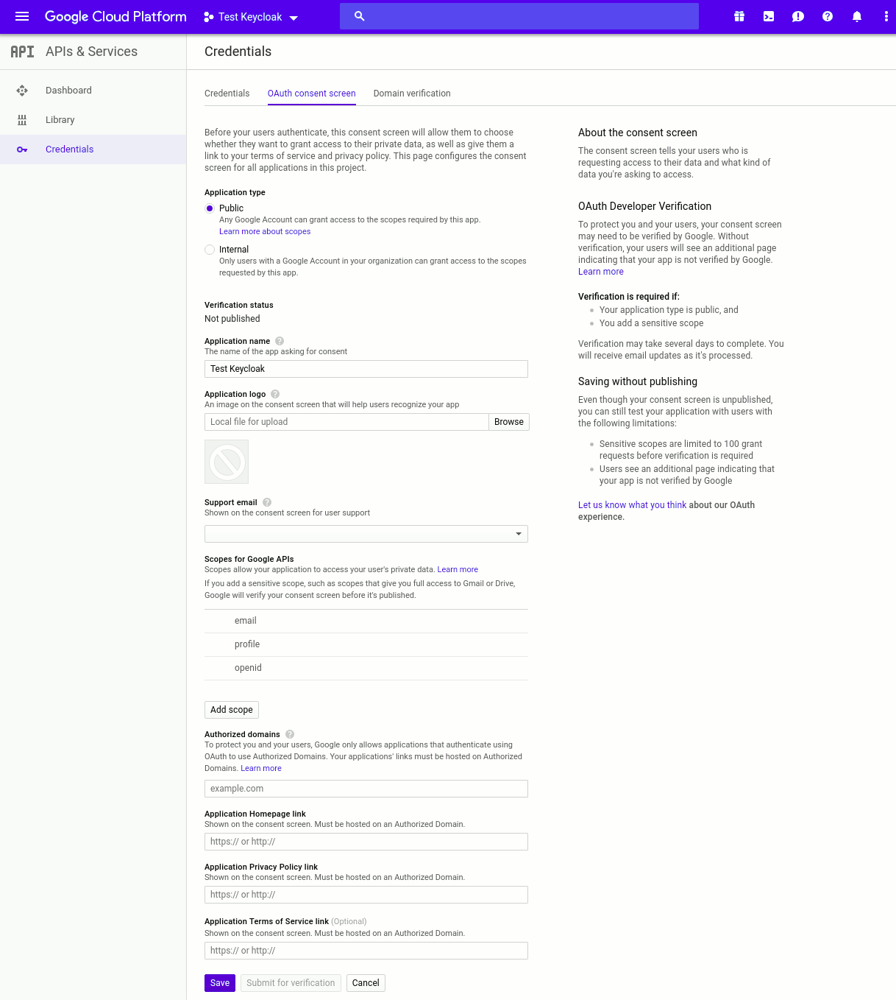

# Keycloak

# What is it?

 - Web app swiss army knife
 - Single sign on client
 - Single sign on provider
 - Identity server

# Connections

 - OpenID Connect
 - OAuth
 - SAML
 - Social Logins
 - LDAP
 - Active Directory

# Setup

## Docker

```
docker run \
    -p 8080:8080 \
    quay.io/keycloak/keycloak:13.0.1
```

## Docker Compose

```
keycloak-db:
  container_name: keycloak-db
  image: mariadb
  restart: always
  volumes:
    - /keycloak/db:/var/lib/mysql
  environment:
    - MYSQL_ROOT_PASSWORD=password
    - MYSQL_DATABASE=keycloak
    - MYSQL_USER=keycloak
    - MYSQL_PASSWORD=password

keycloak:
  container_name: keycloak
  image: jboss/keycloak:9.0.3
  restart: always
  environment:
    - DB_VENDOR=mysql
    - DB_DATABASE=keycloak
    - DB_USER=keycloak
    - DB_PASSWORD=password
    - DB_ADDR=keycloak-db
    - DB_PORT=3306
    - KEYCLOAK_FRONTEND_URL=https://server.com/auth
    - PROXY_ADDRESS_FORWARDING=true
  depends_on:
    - keycloak-db
  ports:
    - 8080:8080
```

## Create Admin User

 - Go To: `https://server.com/auth`
 - Follow the prompts

## Create A Realm

 - Go To: `https://server.com/`
 - Log in with admin user
 - Click "Master"
 - Click Add
 - Set Name

# User Management

## Standalone

 - Create users in the admin console
 
## Standalone


## Social

 - https://www.keycloak.org/docs/latest/server_admin/index.html#social-identity-providers

## Social


## Social


## Social



## Social


## Social


## LDAP

 - https://www.keycloak.org/docs/latest/server_admin/index.html#_ldap

## LDAP

 - 

# Usage

## OpenID Connect

 - The easiest way to integrate by far
 - Most apps: /realms/{realm-name}/.well-known/openid-configuration
 - Nextcloud

## SAML

 - Just Don't

## LDAP / Active Directory

 - See Joe's Talk `;)`
 - Can't use with social logins

## Identity Proxy

 - https://github.com/oauth2-proxy/oauth2-proxy
 - Secure any webapp behind authentication
 - Can double up to secure against pre-auth exploits (*cough* HomeAssistant *cough*)
 - Probably not supported by apps
  
## Identity Proxy

```
oauth-proxy:
  container_name: oauth-proxy
  image: quay.io/oauth2-proxy/oauth2-proxy 
  restart: always
  environment:
   - OAUTH2_PROXY_UPSTREAMS=http://127.0.0.1:8080/
   - OAUTH2_PROXY_PROVIDER=keycloak
   - OAUTH2_PROXY_CLIENT_ID=<client you have created>
   - OAUTH2_PROXY_CLIENT_SECRET=<your client's secret>
   - OAUTH2_PROXY_LOGIN_URL="http(s)://<keycloak host>/auth/realms/<your realm>/protocol/openid-connect/auth"
   - OAUTH2_PROXY_REDEEM_URL="http(s)://<keycloak host>/auth/realms/<your realm>/protocol/openid-connect/token"
   - OAUTH2_PROXY_PROFILE_URL="http(s)://<keycloak host>/auth/realms/<your realm>/protocol/openid-connect/userinfo"
   - OAUTH2_PROXY_VALIDATE_URL="http(s)://<keycloak host>/auth/realms/<your realm>/protocol/openid-connect/userinfo"
   - OAUTH2_PROXY_KEYCLOAK_GROUP=<first_allowed_user_group>
   - OAUTH2_PROXY_EMAIL_DOMAINS=*
   - OAUTH2_PROXY_COOKIE_SECRET=Y0KYcBBqJ6Cj886voJciHA==
   - OAUTH2_PROXY_HTTP_ADDRESS=0.0.0.0:4180
  depends_on:
    - keycloak
  ports:
    - 4180:4180
```
